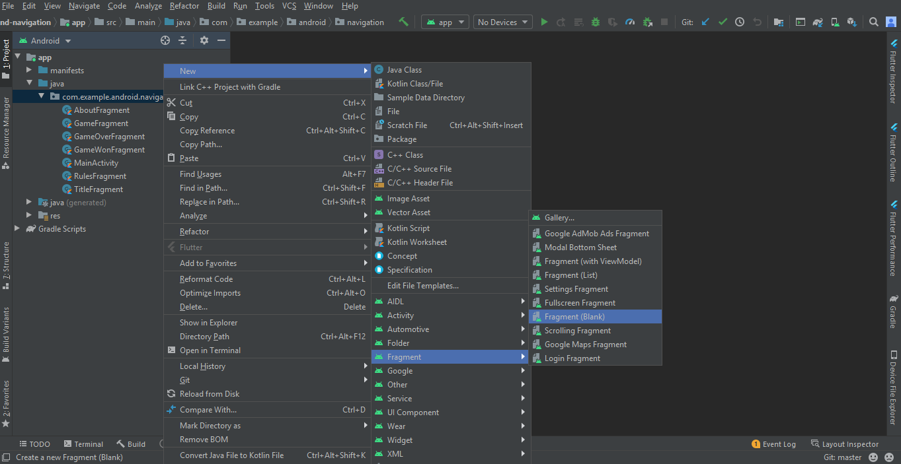
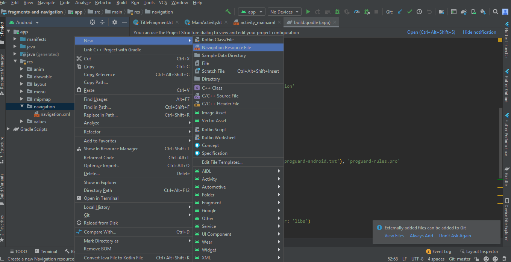
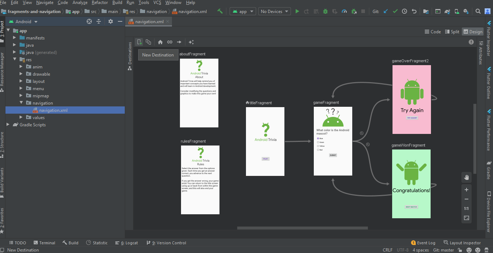

# Fragments and Navigation

## Topics Covered
* Creating and Adding a Fragment
* Navigation Component (Navigation Graph)
* Conditional Navigation
* Back Stacks Manipulation
* NavController with ActionBar
* * Pass data between fragments - though SafeArgs (Safe Arguments)
* Explicit and Implicit Intents (share you quiz results on other apps like whatsapp etc. )
* Animation between fragments**
* BONUS 1: Add a menu
* BONUS 2: Add a navigation Dwawer

** : not yet fully updated

---

## 1. Creating and Adding a Fragment

### 1.1 Create a Fragment

Create a Fragment by <strong> New - Fragment - Fragment(Blank) </strong>



### 1.2 Add a Fragment

```
override fun onCreateView(inflater: LayoutInflater, container: ViewGroup?,
                         savedInstanceState: Bundle?): View? {
   val binding = DataBindingUtil.inflate<FragmentTitleBinding>(inflater, R.layout.fragment_title, container, false)
   return binding.root
}
```
---

## 2. Navigation Graph

### 2.1 Add dependencies to Gradle

Add this to Gradle - Project
```
buildscript {
    ext {
        version_navigation = '1.0.0'
    }
```
then,
Add this to Gradle - App
```
dependencies {
    implementation "android.arch.navigation:navigation-fragment-ktx:$version_navigation"     
    implementation "android.arch.navigation:navigation-ui-ktx:$version_navigation"
}
```
### 2.2 Add navigation.xml (Navigation Graph)



### 2.3 Add NavHostFragment in Activity Layout
```
<fragment
   android:id="@+id/myNavHostFragment"
   android:name="androidx.navigation.fragment.NavHostFragment"
   android:layout_width="match_parent"
   android:layout_height="match_parent"
   app:navGraph="@navigation/navigation"
   app:defaultNavHost="true"
   />
```

### 2.4 Adding Fragments to Navigation Graph and Connecting them



### 2.5 Navigation by OnClickListener

```
binding.playButton.setOnClickListener { view: View ->
        view.findNavController().navigate(R.id.action_titleFragment_to_gameFragment)
}
```

---

## 3. Conditional Navigation

### 3.1 onClick Navigation based on actions(in the navigation graph) 
```
view.findNavController()
   .navigate(R.id.action_gameFragment_to_gameWonFragment)
```

---

## 4. Back Stack Manipulation

###4.1 Add BackStac by PopTo


---

## 5. NavController with ActionBar Connection

### 5.1 Link the NavController to the ActionBar with NavigationUI.setupWithNavController
```
val navController = this.findNavController(R.id.myNavHostFragment)
```
Link the NavController to our ActionBar.
```
NavigationUI.setupActionBarWithNavController(this, navController)
```

### 5.2 Override the onSupportNavigateUp method from the activity and call navigateUp in nav controller

```
override fun onSupportNavigateUp(): Boolean {
   val navController = this.findNavController(R.id.myNavHostFragment)
   return navController.navigateUp()
}
```

---

## 6. SafeArgs
One can also use putString from Bundle() class but it is not a good practice and can cause several bugs. Therefore, use the method shown below.

### 6.1 Add Dependency
Project Gradle
```
dependencies {
        classpath "androidx.navigation:navigation-safe-args-gradle-plugin:$version_navigation"
    }
```
Project App
```
apply plugin: 'kotlin-kapt'
apply plugin: 'androidx.navigation.safeargs'
```

### 6.2 Switch the GameFragment to use generated NavDirections when navigating to the GameOver and GameWon fragments
```
view.findNavController().navigate(GameFragmentDirections.actionGameFragmentToGameWonFragment(VALUES_YOU_WANT_TO_PASS))

```
and Everywhere else you want to use

### 6.3 Add the numQuestions and numCorrect Integer Arguments using the navigation editor

<strong>Immidiately Clean and Rebuild Project Now</strong>

### 6.4 Add the above 2 parameters in 6.2
```
view.findNavController().navigate(GameFragmentDirections.actionGameFragmentToGameWonFragment(numQuestions,questionIndex))
```
numQuestions(6.4) is the value for numQuestions(6.3)
questionIndex(6.4) is the value for numCorrect(6.3)


### 6.5 Fetch the data in next fragment
```
val args =  GameWonFragmentArgs.fromBundle(arguments!!)
```
	Now use:
```
args.numCorrect
```
	to access the correct answers value

---

## 7. Explicit and Implicit Intents
Explicit Intents- pass data or navigate within the app
Implicit Intents- pass data or navigate with other apps like whatsapp, facebook etc.

<strong>EXAMPLE: Share app results to other app(Implicit Intent)</strong>

### 7.1 add setHasOptionsMenu to true
```
setHasOptionsMenu(true)
```
### 7.2 Create a getShareIntent method. Get the args and build the shareIntent inside
```
// Creating our Share Intent
private fun getShareIntent() : Intent {
   val args = GameWonFragmentArgs.fromBundle(arguments)
   val shareIntent = Intent(Intent.ACTION_SEND)
        shareIntent.setType("text/plain")
            .putExtra(Intent.EXTRA_TEXT, getString(R.string.share_success_text, args.numCorrect, args.numQuestions))
   return shareIntent
}
```
### 7.3 Create a shareSuccess method that starts the activity from the share Intent
```
private fun shareSuccess() {
   startActivity(getShareIntent())
}
```
### 7.4 Override onCreateOptionsMenu and inflate our winner_menu and Hide the sharing menu item if the sharing intent doesn’t resolve to an Activity
```
override fun onCreateOptionsMenu(menu: Menu?, inflater: MenuInflater?) {
   super.onCreateOptionsMenu(menu, inflater)
   inflater?.inflate(R.menu.winner_menu, menu)
   // check if the activity resolves
   if (null == getShareIntent().resolveActivity(activity!!.packageManager)) {
       // hide the menu item if it doesn't resolve
       menu?.findItem(R.id.share)?.setVisible(false)
   }
}
```
### 7.5 Override onOptionsIemSelected to link the menu to the shareSuccess action
```
// Sharing from the Menu
override fun onOptionsItemSelected(item: MenuItem?): Boolean {
   when (item!!.itemId) {
       R.id.share -> shareSuccess()
   }
   return super.onOptionsItemSelected(item)
}
```


 